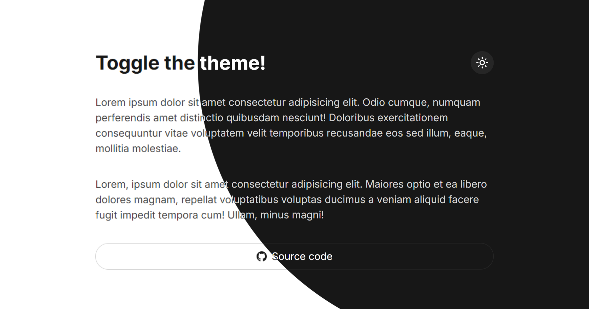

# fancy-theme-switcher

[](https://malkiii.github.io/fancy-theme-switcher)

> a theme toggle button built using the [View Transitions API](https://developer.mozilla.org/en-US/docs/Web/API/ViewTransition), you can copy the code directly from [`public/script.js`](https://github.com/malkiii/fancy-theme-switcher/blob/master/public/script.js) file. See the [demo](https://malkiii.github.io/fancy-theme-switcher).

# Local Setup

To install dependencies:

```bash
bun install
```

To run:

```bash
bun run dev
```
